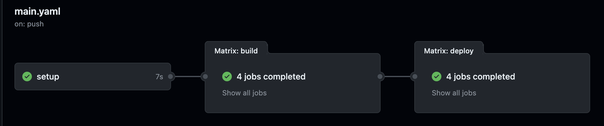
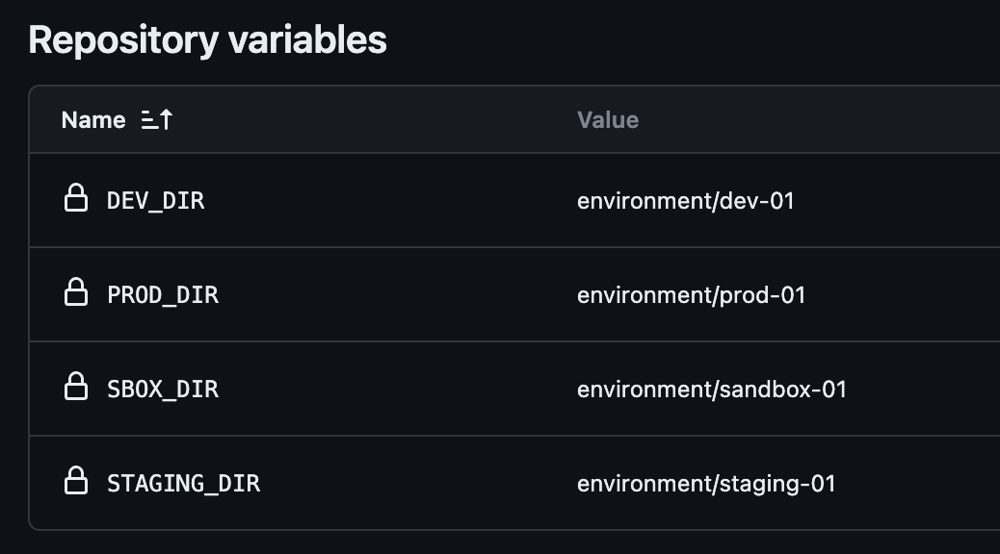
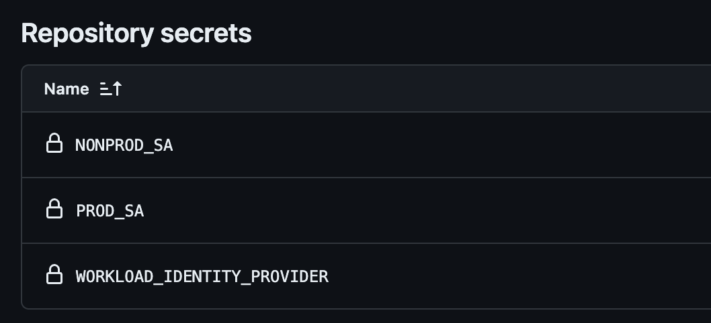

# Path Based Workflow

This is an alternative way of running terraform pipelines based on changes made to certain working directories or environments. 



It's useful when you don't have the possibility of using Terraform Cloud to manage workspaces and environment variables, or other tools like terragrunt, Spacelift, env0 or any other similar that can manage enviroment inputs.

The pipeline workflow uses the following resources:

- [Workload Identity Federation](#workload-identity-federation) 
- [GitHub Variables](#github-variables)
- [Main Workflow](#main-workflow)
- [Deployment Jobs](#deployment-jobs)
    - [1. Setup](#1-setup)
    - [2. Build](#2-build)
    - [3. Deploy](#3-deploy)

We also recommend using [**self-hosted**](https://docs.github.com/en/actions/hosting-your-own-runners/managing-self-hosted-runners/about-self-hosted-runners) runners to avoid hitting GitHub Actions [minutes limit](https://docs.github.com/es/billing/managing-billing-for-github-actions/about-billing-for-github-actions#included-storage-and-minutes).


## Workload Identity Federation

We'll use [Workload Identity Federation](https://cloud.google.com/blog/products/identity-security/enabling-keyless-authentication-from-github-actions) as described in [this](../../../README.md#github-actions-terraform-workflows-with-workload-identity-federation-wif) document but with different service accounts for `prod` and `non-prod` environments to align with the principle of least privilege and separation of concerns.

This means allowing the workload identity provider to impersonate each service account and granting each service account the necessary permissions to manage the resources in their corresponding environments. 

## GitHub Variables

Decide which are the valid paths to run terraform pipelines and set them as GitHub *environment variables*. 

The valid working directories in this case will be the ones located in the `environments` folder:

```bash

├── environments
    ├── dev-01
    ├── prod-01
    ├── sandbox-01
    └── staging-01

```

Configuration will look like:



We also use GitHub *secret variables* to store and protect the service account identities and the workload identity provider. Configuration will look as follows:



Only users with *repository Admin* role can access and modify these variables.

## Main Workflow

The main workflow is defined in the [main.yml](main.yaml) file and it's where the pipeline begins. 

It contains 4 blocks:

- `on:`: Defines the events that trigger the workflow. In this case, the workflow is triggered on every pull-request and push to the main branch.

- `concurrency`: Ensures that only a single job or workflow using the same concurrency group will run at a time. The concurrency group is set to the github branch ref id and the workflow name. 

    This prevents terraform states from getting locked by the runners when multiple jobs are running at the same time.

- `env`: Defines the service account *secret* environment variables to be used later in the jobs.

- `jobs`: This are the deployment jobs described in the next section.


## Deployment Jobs

There are three deployment jobs in the [main](main.yaml) workflow: 

### 1. Setup

Runs the following steps:

- `get_changed_folders`: uses [stockopedia/action-get-changed-filev2@.0.0s](https://github.com/Stockopedia/action-get-changed-files) action to get a list of the files that have changed in the pull-request and outputs them to a json file.

- `updated_paths`: unfortunately, the json file outputed from the previous step doesn't have a valid json format. This step is a bash script that fixes the format, deletes duplicates and invalid paths to build a list of working directories to be updated.

- `validation`: checks that the updated paths is not an empty list. If it is, next job will not trigger.

Environments will tipically use *source modules* located in a different path. Since all environments use the same modules, changes made to those will not automatically trigger updates on the environments to avoid unestable updates in sensitive environments.

To force terraform jobs to run in those cases, you’ll have to temporarily add a simple or *dummy* change on the environment you want to update. 

### 2. Build 

Runs the [*Terraform CI*](terraform-ci.yaml) workflow on each path from the list outputed in the previous job. It will only run if the list is not empty.

The *Terraform CI* workflow has the following inputs variables:

- `working-directory`: the working directory to be updated.
- `checkov-ignore`: a list of checkov policies to be ignored. 
- `checkov-default-ignore`: default list of policies to be ignored that are not relevant to the environment.

It also has a `secrets` definition with the service account [secret variables](#github-variables) that are being inherited from the main workflow.

This workflow runs the following steps:

- `select_sa`: bash script that compares the input working directory with the list of working directories stored in the environment variables and selects the corresponding service account identity.

- `auth`: uses [google-github-actions/auth@v1](https://github.com/google-github-actions/auth) action to authenticate the selected service account identity to GCP using workload identity federation.

- `Set up Cloud SDK`: uses [google-github-actions/setup-gcloud@v1](https://github.com/google-github-actions/setup-gcloud) action to install and configure the Google Cloud SDK.

- `Setup Terraform`: uses [hashicorp/setup-terraform@v3](https://github.com/hashicorp/setup-terraform) action to install and configure Terraform.

- `fmt`: runs terraform format validation command.

- `init`: runs terraform init command to initialize the working directory.

- `validate`: runs and outputs terraform validate command to find any errors in the configuration files.

- `plan`: runs terraform plan command to create an execution plan.

- `checkov`: uses [bridgecrewio/checkov-action@master](https://github.com/bridgecrewio/checkov-action) action to review the terraform modules and identify misconfigurations, vulnerabilities, and license compliance issues. Uses the input variables to ignore the policies defined in the `checkov-ignore` and `checkov-default-ignore` lists.

- `Github console output`: uses [actions/github-script@v3](https://github.com/actions/github-script) action to output the terraform plan and checkov results to the GitHub console.

- `Terraform Plan Status`: indicates if the terraform plan was successful or not.

If all the steps are executed successfully on a pull-request, the job will be marked as *passed* and the pull-request will be ready to be merged.

If any of the steps fails, the job will be marked as *failed* and merging the pull-request will be blocked.


### 3. Deploy

Runs the [*Terraform CD*](terraform-cd.yaml) workflow on each path from the list outputed in the *setup* job. It will only run on push events to the *main* branch (after a pull-request) and if the *build* step was successful.

The *Terraform CD* workflow has the `working-directory` input variables, which is the working directory to be updated.

It also has a `secrets` definition with the service account [secret variables](#github-variables) that are being inherited from the main workflow.

This workflow runs the following steps:

- `select_sa`: bash script that compares the input working directory with the list of working directories stored in the environment variables and selects the corresponding service account identity.

- `auth`: uses [google-github-actions/auth@v1](https://github.com/google-github-actions/auth) action to authenticate the selected service account identity to GCP using workload identity federation.

- `Set up Cloud SDK`: uses [google-github-actions/setup-gcloud@v1](https://github.com/google-github-actions/setup-gcloud) action to install and configure the Google Cloud SDK.

- `Setup Terraform`: uses [hashicorp/setup-terraform@v3](https://github.com/hashicorp/setup-terraform) action to install and configure Terraform.

- `init`: runs terraform init command to initialize the working directory.

- `Terraform Apply`: runs terraform apply command with the *-auto-approve* flag to apply the changes to the environment.


